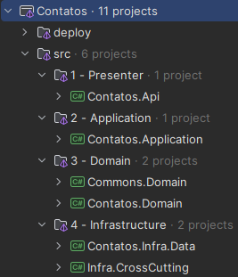
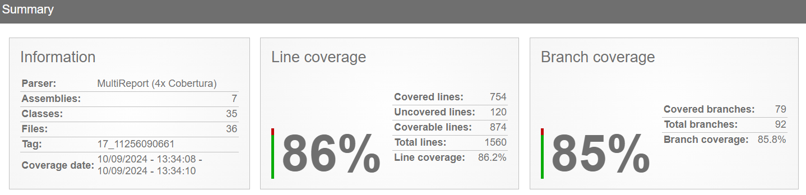
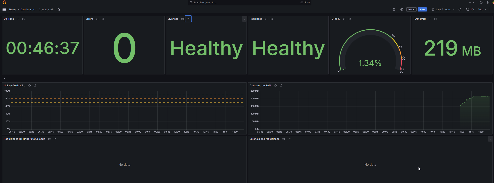

# Tech Challenge - Arquitetura de Sistemas .NET com Azure 🚀
Este projeto é parte da entrega da atividade prática do curso de **Arquitetura de Sistemas .NET com Azure**.

O Tech Challenge é dividido em 5 fases. A seguir, uma descrição sucinta de cada uma das fases em que esse repositório foi utilizado:

- **Fase 1**: Implementação de uma API Web para cadastrar, buscar, atualizar e excluir contatos. A API deve permitir que o contato seja localizado por região, a partir de um código DDD informado pelo usuário.
- **Fase 2**: Incluir testes de integração na API desenvolvida na Fase 1, implementar um pipeline de CI/CD e monitorar a API com Prometheus e Grafana.

## Tecnologias Utilizadas ⚙️

### API
- .NET 8
  - Entity Framework Core
  - Dapper
  - xUnit
### Base de dados
- PostgreSQL

### Ambiente de desenvolvimento
- Docker

### Telemetria e Observabilidade
- Prometheus
- Grafana

## Arquitetura 🏛️
A arquitetura do projeto foi baseada na abordagem do DDD (Domain Driven Design) e Clean Architecture. A estrutura do projeto foi dividida em camadas, sendo elas:

### Presenter 
- **Contatos.Api**: Camada de apresentação da aplicação, responsável por receber as requisições HTTP e retornar as respostas ao solicitante.

### Application 
- **Contatos.Application**: Camada de aplicação, responsável por orquestrar as chamadas aos métodos de repositório e realizar as validações necessárias para o processamento de um fluxo (Caso de Uso).

### Domain 
- **Contatos.Domain**: Camada de domínio, responsável por armazenar as entidades e interfaces de repositório.
- **Commons.Domain**: Camada de compartilhamento, responsável por armazenar classes e métodos que são compartilhados entre as demais camadas.

### Infraestrutura
- **Contatos.Infra.Data**: Camada de infraestrutura, responsável por implementar as interfaces de repositório e realizar a comunicação com o banco de dados.

### Overview da arquitetura 🗃️



## Testes 🧪
Na Fase 1, foram implementados testes unitários e a fase 2 contempla a implementação de testes de integração.
Os testes foram implementados utilizando a biblioteca xUnit. 
### Executando os testes
Para executar os testes, basta executar o seguinte comando na comando na raiz do projeto:
```bash
dotnet test
```
### Cobertura de Testes
A cobertura de testes foi realizada utilizando a ferramenta **Coverlet** e **Report Generator** para uma exibição dos resultados. 
Para visualizar a cobertura de testes, execute o seguinte comando na raiz do projeto:
```bash
dotnet test --collect:"XPlat Code Coverage" --results-directory ./test/results/coverlet/ && reportgenerator -reports:test/results/coverlet/**/coverage.cobertura.xml -targetdir:test/results/coverage-report -reporttypes:Html
```
O relatório de cobertura de testes estará disponível na pasta `test/results/coverage-report/index.html`.
Além disso, o relatório de cobertura de testes é executado automaticamente no pipeline de CI/CD a cada integração com a branch principal `(main)` e pode ser visualizado no [GitHub Pages](https://pedrobarao.github.io/fiap.5nett.contatos/) do projeto.

> Atenção: Para gerar o relatório de cobertura de testes, é necessário ter o **Report Generator** instalado em sua máquina, conforme instruções disponíveis [aqui](https://danielpalme.github.io/ReportGenerator/usage.html).



## Executando a aplicação ✔️

### Requisitos
- .NET 8
- Docker

### Passo a passo

1 - Certifique-se de que o Docker esteja rodando em sua máquina.

2 - Na raíz do projeto execute o seguinte comando:
```bash
docker compose -f .\deploy\docker-compose.yaml -p tech-challenge up -d --build
```
Esse comando irá fazer o build da aplicação e subir o container com a aplicação e recursos necessários.

3 - Ao iniciarmos a aplicação pela primeira vez o migrations para criação do banco de dados será executado. Para fazer isso manualmente execute o seguinte comando:
```bash
dotnet ef database update -p .\src\Fase1.Contatos.Infra.Data\Fase1.Contatos.Infra.Data.csproj -s .\src\Fase1.Contatos.Api\Fase1.Contatos.Api.csproj -c ContatoDbContext
```
Pronto! A aplicação está pronta para ser utilizada.

## Monitorando a API 🔎

Ao iniciarmos o container o Prometheus e Grafana também são iniciados. Os deashboard do Grafana já estão configurados para monitorar a aplicação.

### Passo a passo

1 - Acesse o Grafana em `http://localhost:3000` e faça login com as credenciais `admin` e `root`.

2 - Selecione o dashboard `Contatos API` para visualizar as métricas da aplicação.



Cada uma das visualizações contém uma descrição detalhada das métricas monitoradas.